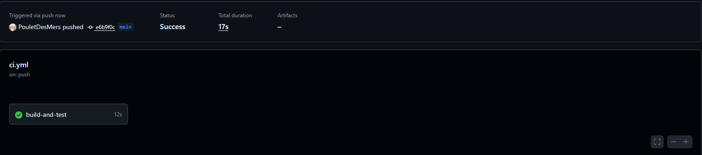

# projet---citations

Lien du repository : [ICI](https://github.com/PouletDesMers/projet---citations)

Après avoir créé un repository sur GitHub, clonez-le sur votre machine locale avec la commande :  
`git clone https://github.com/PouletDesMers/projet---citations`  
Ensuite, dans les paramètres du repository sur GitHub, vérifiez que les options "Allow GitHub Actions to create and approve pull requests" et "Allow all actions and reusable workflows" sont activées pour pouvoir utiliser les workflows.

## Installation

Après le clone je me rends dans le dossier du projet avec la commande `cd projet---citations` et j'initialise le projet avec la commande `npm init -y` puis j'installe jest pour les tests avec la commande `npm install --save-dev jest` et je modifie le fichier package.json pour ajouter `"test": "jest"`.

## Utilisation

en fesant `npm test` on obtient 
```sh
projet---citations main  ? ✗ npm test

> projet---citations@1.0.0 test
> jest

 PASS  test/app.test.js
  ✓ La fonction retourne une citation (6 ms)

Test Suites: 1 passed, 1 total
Tests:       1 passed, 1 total
Snapshots:   0 total
Time:        0.682 s
Ran all test suites.
```

## Workflows

Je crée un dossier `.github/workflows` à la racine du projet et j'ajoute un fichier `ci-cd.yml` pour automatiser les tests avec GitHub Actions.
