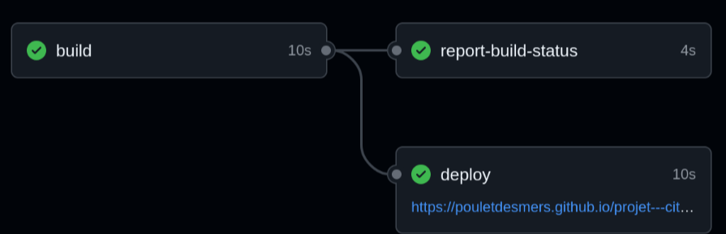

# Projet — Citations

## Objectif du projet

Le but de ce projet est de créer une application simple qui affiche aléatoirement des citations.
L’objectif principal est d’apprendre à :

* Structurer un projet Node.js,
* Mettre en place des tests unitaires avec **Jest**,
* Configurer une intégration continue (**CI/CD**) avec **GitHub Actions**,
* Et déployer automatiquement le site sur **GitHub Pages**.

🔗 [Lien du repository](https://github.com/PouletDesMers/projet---citations)
🌐 [Lien de la page déployée](https://pouletdesmers.github.io/projet---citations/)

---

## 🧱 Structure du code

Le projet est organisé de la façon suivante :

```
projet---citations/
├── app.js                # Code principal
├── test/
│   ├── index.html            # Fichier HTML pour le déploiement GitHub Pages
│   └── app.test.js           # Tests unitaires avec Jest
└── .github/
    └── workflows/
        └── ci-cd.yml     # Pipeline CI/CD
```

### Installation

```bash
git clone https://github.com/PouletDesMers/projet---citations
cd projet---citations
npm init -y
npm install --save-dev jest
```

Ensuite, dans le fichier `package.json`, ajoute la ligne suivante :

```json
"test": "jest"
```

Pour lancer les tests :

```bash
npm test
```

---

## Description du pipeline CI/CD

Le pipeline est configuré avec **GitHub Actions**.
Il comprend deux étapes principales :

1. **Tests automatiques** :
   Chaque fois qu’un commit est poussé, les tests Jest sont exécutés automatiquement pour s’assurer que tout fonctionne.
   

2. **Déploiement automatique** :
   Si les tests réussissent et que la branche est `main`, le site est déployé sur **GitHub Pages** depuis le dossier `src/`.
  


### Visualisation du fichier `ci-cd.yml`

```yml
name: CI/CD Node.js - Générateur de citations

on:
  push:
    branches: [main]
  pull_request:
    branches: [main]

permissions:
  contents: write

jobs:
  build-and-test:
    runs-on: ubuntu-latest
    
    steps:
      - name: Checkout code
        uses: actions/checkout@v4

      - name: Setup Node.js
        uses: actions/setup-node@v4
        with:
          node-version: 20

      - name: Install dependencies
        run: npm ci

      - name: Run tests
        run: npm test

  deploy:
    needs: build-and-test
    runs-on: ubuntu-latest
    if: github.ref == 'refs/heads/main'
    steps:
      - name: Checkout repository
        uses: actions/checkout@v4

      - name: Deploy to GitHub Pages
        uses: peaceiris/actions-gh-pages@v3
        with:
          github_token: ${{ secrets.GITHUB_TOKEN }}
          publish_dir: ./src
```

---

## Difficultés rencontrées

* Configuration des permissions GitHub Actions pour autoriser les déploiements.
* Compréhension du fonctionnement des workflows et de leurs dépendances.
* Ajustement du dossier de build pour que le déploiement fonctionne correctement sur GitHub Pages.

---

## Améliorations possibles
* Ajouter une interface utilisateur plus sophistiquée avec du CSS.
* Permettre aux utilisateurs de soumettre leurs propres citations.